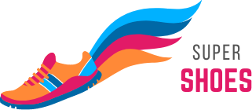

# SUPER SHOES - Carrossel Interativo

  

## 🚀 Sobre o Projeto

*SUPER SHOES* é um carrossel interativo desenvolvido em React que exibe uma coleção de tênis esportivos. Este projeto demonstra técnicas modernas de desenvolvimento front-end utilizando React Hooks para criar uma experiência de usuário fluida e responsiva.

## ✨ Funcionalidades

- *Navegação Interativa*: Permite navegar entre os produtos usando botões ou gestos
- *Transições Suaves*: Animações fluidas entre os itens do carrossel
- *Controle Automático*: Rotação automática dos itens com intervalo configurável
- *Totalmente Responsivo*: Adapta-se a diferentes tamanhos de tela

## 🛠 Tecnologias Utilizadas

- *React.js* - Biblioteca JavaScript para construção de interfaces
- *React Hooks*:
  - useState - Gerenciamento de estado do componente
  - useEffect - Efeitos colaterais e lifecycle
  - useRef - Referência a elementos DOM
- *CSS Moderno* - Estilização com flexbox e animações CSS

## ✨ Destaques Técnicos

- *Tecnologias*: 
  - 
  - 
  
- *Features*:
  - Navegação por botões ou gestos
  - Auto-rotação configurável
  - Efeitos de transição CSS3
  - 100% responsivo

 https://zerogallo.github.io/carrossel/ 

